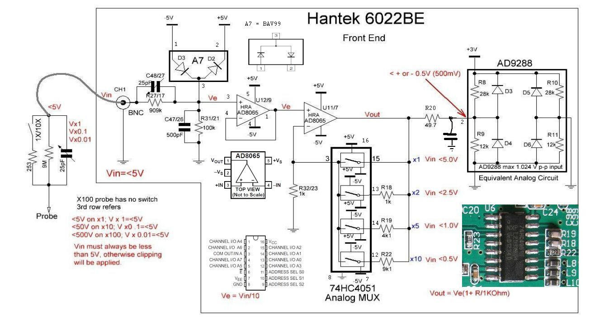

# Hardware difference between 6022BE and 6022BL

A good overview can be found in the sigrok wiki:
https://sigrok.org/wiki/Hantek_6022BE
https://sigrok.org/wiki/Hantek_6022BL

according the diff between sigrok firmware versions

| Function | Hantek6022BE | Hantek6022BL |
|----------|--------------|--------------|
| Analog Mode? | n.a. | PA7=1 |
| 2V / 1kHz out | PA7 | PC2 |
| GPIF OUT0 | 1<<6 | 1<<4 |
| CH0 range | IOC bit 2,3,4 | IOA bit 1,2,3 |
| CH1 range | IOC bit 5,6,7 | IOA bit 4,5,6 |

## Frontend schematics of 6022BE

